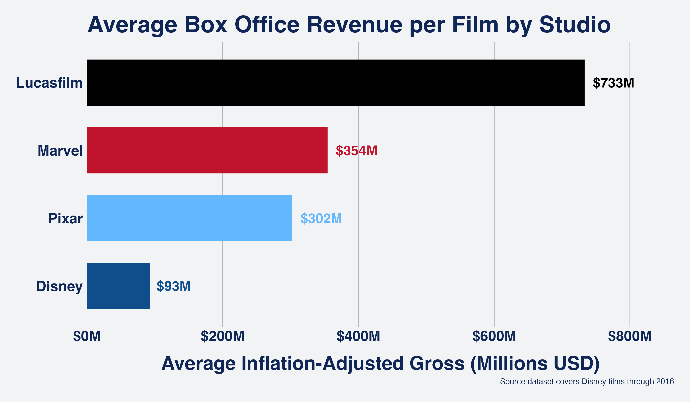
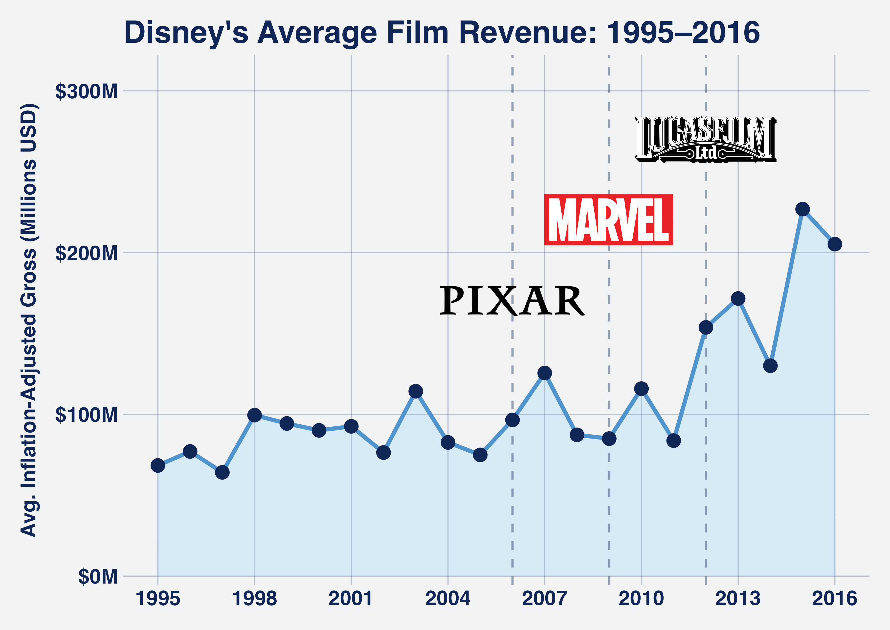
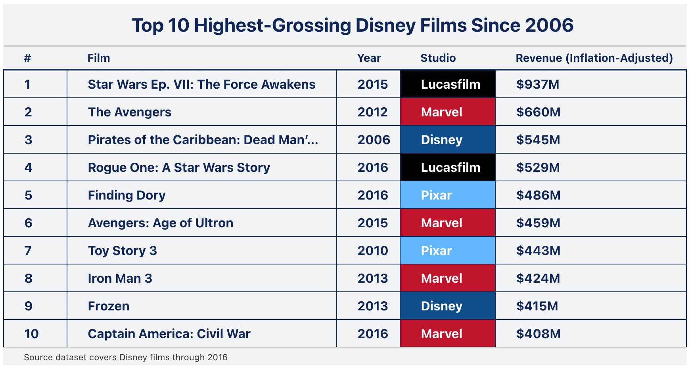
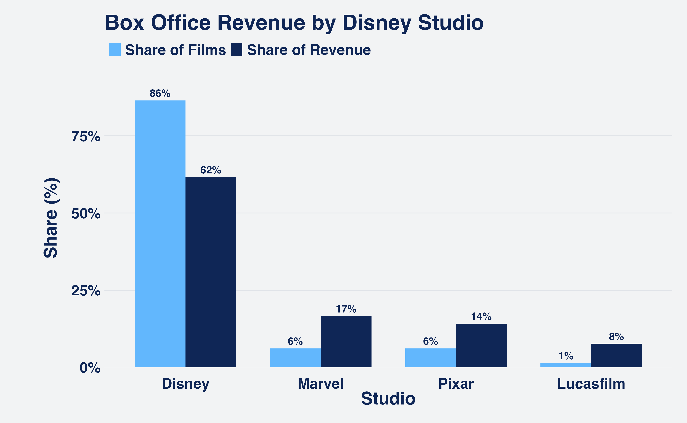

```{r}
# load pakages
library(tidyverse)
library(lubridate)
library(readr)
library(scales)
library(gt)
library(ggimage)
```


## Introduction
Between 2006 and 2016, Disney executed three of the most consequential acquisitions in entertainment history: **Pixar** ($7.4B, 2006), **Marvel** ($4.0B, 2009), and **Lucasfilm** ($4.05B, 2012). This report examines how those acquisitions reshaped Disney's box office performance using inflation-adjusted gross revenue across 579 films.

## Motivation

I chose this dataset because it shows Disney's full box office history, making it ideal for exploring how its acquisitions impacted financial performance. I also love Disney, so this dataset is particularly interesting to me personally. I am especially interested in understanding how acquiring **Pixar (2006), Marvel (2009), and Lucasfilm (2012)** changed Disney's box office performance over time.

**By analyzing this data, I can explore key questions like:**

- Did Disney's acquisitions actually lead to higher box office success?
- Do acquired studios generate a disproportionate share of revenue relative to the number of films they produce?

## Data source
The dataset used for this analysis is `disney_boxoffice_history.csv`, sourced from [Kaggle](https://www.kaggle.com/datasets/suvroo/disney-movies-dataset). It contains historical box office data for Disney films, including total gross revenue and inflation-adjusted revenue. The dataset was originally titled *Disney Movies Dataset* on Kaggle and was downloaded from the following source:

**Citation:**  
Suvroo. (n.d.). *Disney Movies Dataset*. Kaggle. Retrieved from [Kaggle](https://www.kaggle.com/datasets/suvroo/disney-movies-dataset)

## Data Overview

```{r} 
#| label: tbl-load-summary
#| tbl-cap: "Summary of Disney Box Office Dataset" 
#| echo: FALSE


# load packages
library(knitr)
load("data/data_summary.RData")

# display the table using kable
kable(summary_table, col.names = c("Metric", "Value"))
```

From @tbl-load-summary, we can see that the dataset contains **579 observations** and **6 variables**, with a mix of **2 numeric variables** and **4 categorical variables**. There are **no missing values** so we will have complete data for our analysis. The numeric variables, including revenue figures, allow for financial comparisons, while categorical variables, such as `genre` and `MPAA rating`, help analyze trends across different film categories.


## Average Revenue Per Film by Studio



Lucasfilm leads all studios with an average of **$733M per film**, driven by just two releases: *The Force Awakens* and *Rogue One*. Marvel follows at **$354M** across 9 films, and Pixar at **$302M** across 9 films. Disney's own label averages just **$93M per film** — a figure that reflects not poor performance, but sheer volume. With 128 films released in the same period, Disney's average is pulled down by a long tail of smaller releases across a wide range of genres and budgets. The acquired studios, by contrast, release selectively and at scale, which is precisely what drives their outsized per-film averages.


## Disney's Average Film Revenue Over Time



Disney's portfolio average was relatively flat from 1995 through 2005, hovering between **$65M–$115M per film**. Following the Pixar acquisition in 2006, average revenue began trending upward. The Marvel and Lucasfilm acquisitions accelerated this further, with the portfolio average reaching **$240M by 2015** — more than triple the pre-acquisition baseline.


## Top 10 Highest-Grossing Disney Films Since 2006



Eight of Disney's ten highest-grossing films since 2006 belong to an acquired studio. *Star Wars: The Force Awakens* tops the list at **$937M**, followed by *The Avengers* at **$660M**. The only Disney-studio films in the top 10 are *Pirates of the Caribbean: Dead Man's Chest* ($545M) and *Frozen* ($415M).


## Film Output vs. Revenue Share by Studio



Disney's own studio produces **86% of all films** but captures only **62% of total box office revenue**. The three acquired studios collectively produce just **14% of films** while generating **38% of revenue**. Lucasfilm is the most extreme case (1% of films, 8% of revenue) from just two Star Wars releases.


## Key Findings

- Acquired studios average **3–8x more revenue per film** than Disney's core label
- Disney's portfolio average revenue per film grew **3x** between 2005 and 2016
- **8 of the top 10** highest-grossing Disney films since 2006 came from acquired studios
- Acquired studios produce a disproportionate share of revenue relative to film output, suggesting Disney's acquisition strategy was highly effective at the box office


*Source dataset covers Walt Disney Studios theatrical releases through 2016. All revenue figures are inflation-adjusted.*